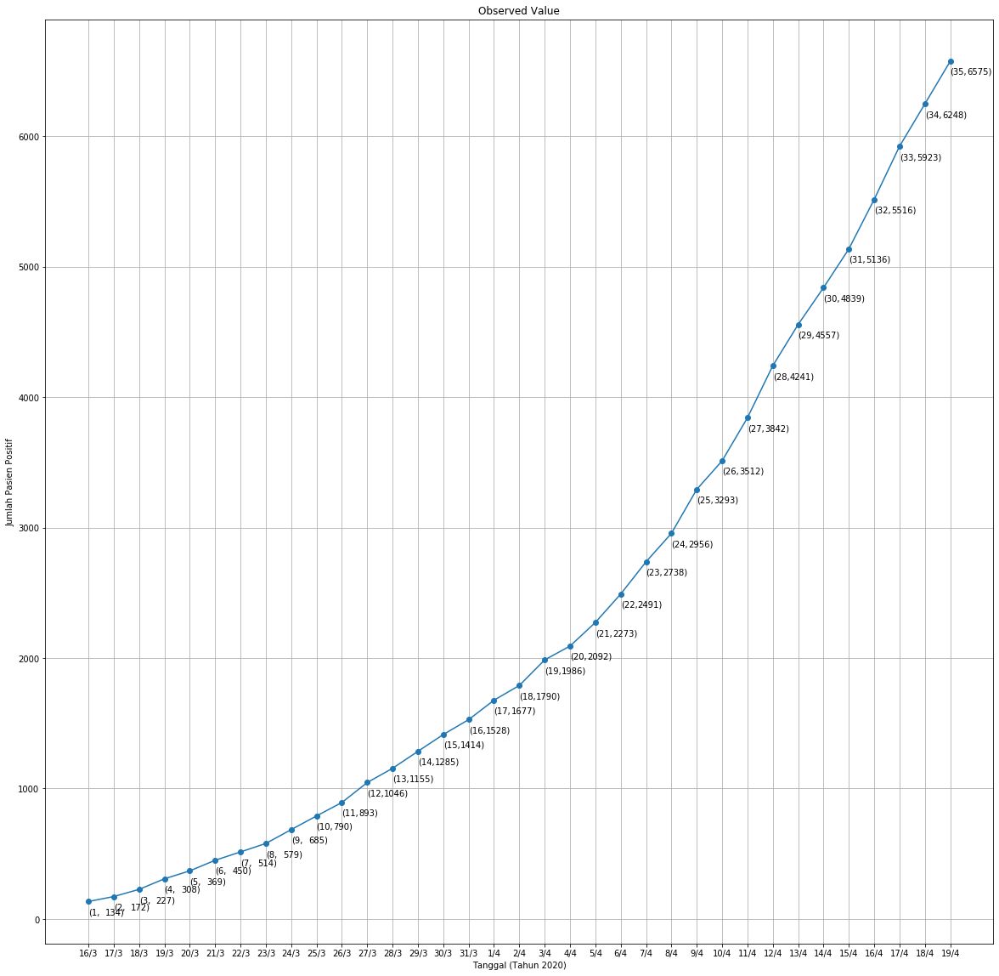
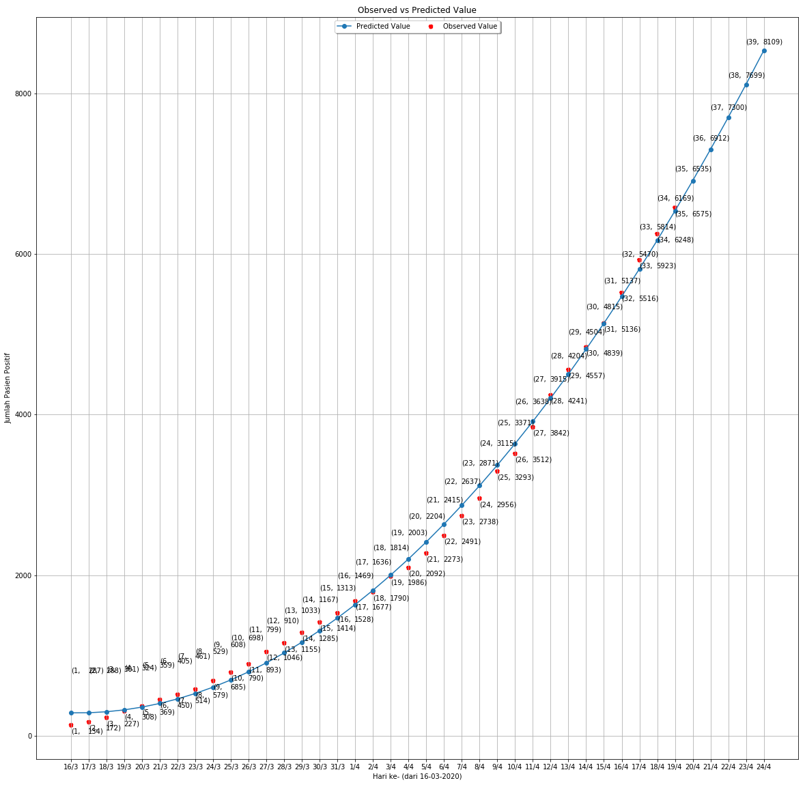
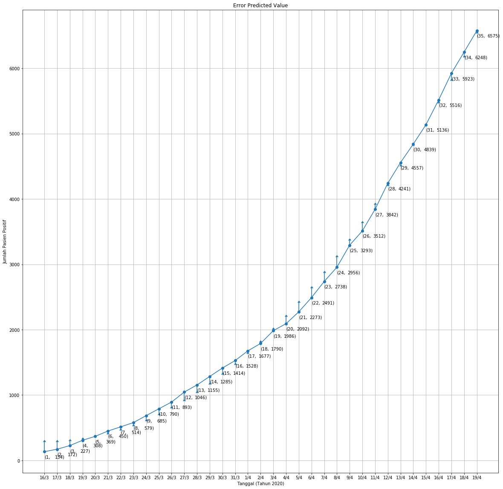

```python
import pandas as pd
import numpy as np
import matplotlib.pyplot as plt
import sqlite3
import os
```


```python
class QuadraticRegression:
    
    def __init__(self, start_date, number_initial_case, addition_case_data):
        dates = pd.date_range(start_date, periods=len(addition_case_data) + 1) 
        self.start_date = start_date
        self.total_positive_accumulative = pd.DataFrame([[0, number_initial_case]], index=[dates[0]], columns=['Penambahan Kasus Positif','Total Kasus Positif'])

        cumulative_positive = number_initial_case
        for idx, addition_case in enumerate(addition_case_data):
            cumulative_positive += addition_case[1]
            temp = pd.DataFrame([[addition_case[1], cumulative_positive]], columns=['Penambahan Kasus Positif','Total Kasus Positif'], index=[dates[idx+1]])
            self.total_positive_accumulative = self.total_positive_accumulative.append(temp)
        
        self.compute_coefficients()
    
    def compute_x12(self, data_x):
        return [d for d in data_x], [d ** 2 for d in data_x]

    def compute_s11(self, x1):
        s11 = sum([x ** 2 for x in x1])
        return s11 - ((sum(x1) ** 2) / len(x1))

    def compute_s12(self, x1, x2):
        s12 = sum([x * y for x,y in zip(x1,x2)])
        return s12 - (sum(x1) * sum(x2) / len(x1))

    def compute_s22(self, x2):
        s22 = sum([x ** 2 for x in x2])
        return s22 - ((sum(x2) ** 2) / len(x2))

    def compute_y1(self, y, x1):
        sy1 = sum([x * y for x,y in zip(y, x1)])
        return sy1 - (sum(y) * sum(x1) / len(y))

    def compute_y2(self, y, x2):
        sy2 = sum([x * y for x,y in zip(y, x2)])
        return sy2 - (sum(y) * sum(x2) / len(y))

    def average(self, data):
        return sum(data) / len(data)

    def compute_coefficients(self):
        data_x = range(1, len(self.total_positive_accumulative) + 1)
        data_y = self.total_positive_accumulative['Total Kasus Positif']
        x1, x2 = self.compute_x12(data_x)
        s11 = self.compute_s11(x1)
        s12 = self.compute_s12(x1, x2)
        s22 = self.compute_s22(x2)
        sy1 = self.compute_y1(data_y, x1)
        sy2 = self.compute_y2(data_y, x2)
        avg_x1 = self.average(x1)
        avg_x2 = self.average(x2)
        avg_y = self.average(data_y)

        self.b2 = ((sy1 * s22) - (sy2 *s12)) / (s22 * s11 - (s12 ** 2))
        self.b3 = ((sy2 * s11) - (sy1 *s12)) / (s22 * s11 - (s12 ** 2))
        self.b1 = avg_y - (self.b2 * avg_x1) - (self.b3 * avg_x2)

        return self.b1, self.b2, self.b3

    def compute_prediction(self, days):
        dates = pd.date_range(self.start_date, periods=len(self.total_positive_accumulative) + days)
        
        temp = []
        for x in range(1, len(self.total_positive_accumulative) + days + 1):
            if x <= len(self.total_positive_accumulative):
                buffer = pd.DataFrame([[self.total_positive_accumulative['Penambahan Kasus Positif'][x-1], 
                                        self.total_positive_accumulative['Total Kasus Positif'][x-1],
                                        (self.b3 * (x ** 2)) + (self.b2 * x) + self.b1]],
                                      columns=['Penambahan Kasus Positif',
                                               'Total Kasus Positif',
                                               'Prediksi Total Kasus Positif'],
                                      index=[dates[x - 1]])
            else:     
                buffer = pd.DataFrame([[np.nan, 
                                        np.nan,
                                        (self.b3 * (x ** 2)) + (self.b2 * x) + self.b1]],
                                      columns=['Penambahan Kasus Positif',
                                               'Total Kasus Positif',
                                               'Prediksi Total Kasus Positif'],
                                      index=[dates[x - 1]])
            temp.append(buffer)
        
        self.prediction = pd.concat(temp)
        return self.prediction
    
    def sse(self, observed_value, predict_value):
        temp = 0
        for o,p in zip(observed_value, predict_value):
            temp += (o - p) ** 2
        return temp

    def tss(self, observed_value, avg_observed_value):
        temp = 0
        for o in observed_value:
            temp += (o - avg_observed_value) ** 2
        return temp

    def residue(self):
        observed_value = self.total_positive_accumulative['Total Kasus Positif']
        predicted_value = self.prediction['Prediksi Total Kasus Positif']
        avg_observed_value = self.average(observed_value)
        return 1 - (self.sse(observed_value, predicted_value) / self.tss(observed_value, avg_observed_value))

    def rmse(self):
        observed_value = self.total_positive_accumulative['Total Kasus Positif']
        predicted_value = self.prediction['Prediksi Total Kasus Positif']
        temp = 0
        for o,p in zip(observed_value, predicted_value):
            temp += (o - p) ** 2   
        return (temp / len(observed_value)) ** 0.5
    
    def save_data_to_sqlite(self):
        conn = sqlite3.connect('predict_data.sqlite')
        cur = conn.cursor()
        
        if not os.path.exists('predict_data.sqlite'):
            cur.execute('CREATE TABLE data_quadratic (tgl DATE, observed_x INT, observed_y INT, predicted_x INT, predicted_y INT)')
            conn.commit()

            cur.execute('CREATE TABLE quadratic_coefficients (b0 INT, b1 INT, b2 INT)')
            conn.commit()
            
        else:
            cur.execute('DROP TABLE data_quadratic')
            conn.commit()
            
            cur.execute('DROP TABLE quadratic_coefficients')
            conn.commit()
            
            cur.execute('CREATE TABLE data_quadratic (tgl DATE, observed_x INT, observed_y INT, predicted_x INT, predicted_y INT)')
            conn.commit()

            cur.execute('CREATE TABLE quadratic_coefficients (b0 INT, b1 INT, b2 INT)')
            conn.commit()
            
        dates = pd.date_range(self.start_date, periods=len(self.prediction) + 1)
        print(dates)

        for a,b,c,d,e in zip(dates, range(1, len(self.total_positive_accumulative) + 1), self.total_positive_accumulative['Total Kasus Positif'], range(1, len(self.total_positive_accumulative) + 1), self.prediction['Prediksi Total Kasus Positif']):
            cur.execute('INSERT INTO data_quadratic (tgl, observed_x, observed_y, predicted_x, predicted_y) values ("{}", {}, {}, {}, {})'.format(str(a)[:10], b, c, d, e))
            conn.commit()

        for i in range(len(self.total_positive_accumulative), len(self.prediction)):
            cur.execute('INSERT INTO data_quadratic (tgl, observed_x, observed_y, predicted_x, predicted_y) values ("{}", null, null, {}, {})'.format(str(dates[i])[:10], i+1, self.prediction['Prediksi Total Kasus Positif'][i]))
            conn.commit()

        cur.execute('INSERT INTO quadratic_coefficients (b0, b1, b2) values ({}, {}, {})'.format(self.b1, self.b2, self.b3))
        conn.commit()
        conn.close()
```


```python
addition_case_positive_covid = [[17, 38],
                                [18, 55],
                                [19, 81],
                                [20, 61],
                                [21, 81],
                                [22, 64],
                                [23, 65],
                                [24, 106],
                                [25, 105],
                                [26, 103],
                                [27, 153],
                                [28, 109],
                                [29, 130],
                                [30, 129],
                                [31, 114],
                                [1, 149],
                                [2, 113],
                                [3, 196],
                                [4, 106],
                                [5, 181],
                                [6, 218],
                                [7, 247],
                                [8, 218],
                                [9, 337],
                                [10, 219],
                                [11, 330],
                                [12, 399],
                                [13, 316],
                                [14, 282],
                                [15, 297],
                                [16, 380],
                                [17, 407],
                                [18, 325],
                                [19, 327],
                         ]
```


```python
covid19 = QuadraticRegression('20200316', 134, addition_case_data=addition_case_positive_covid)
```


```python
total_positive_accumulative = covid19.total_positive_accumulative

plt.figure(figsize=(20,20))
plt.title('Observed Value')
plt.xlabel('Tanggal (Tahun 2020)')
plt.ylabel('Jumlah Pasien Positif')

dates = pd.date_range(covid19.start_date, periods=len(total_positive_accumulative))

plt.plot([d.strftime("%-d/%-m") for d in dates], total_positive_accumulative['Total Kasus Positif'], marker='o', label='Observed Value')

for i,j in zip(range(0, len(total_positive_accumulative)), total_positive_accumulative['Total Kasus Positif']):
    plt.annotate('%i)' %j, xy=(i,j-100), xytext=(20,0), textcoords='offset points')
    plt.annotate('(%i,' %(i+1), xy=(i,j-100))
    
fig_manager = plt.get_current_fig_manager()
if hasattr(fig_manager, 'window'):
    fig_manager.window.showMaximized()

plt.grid()
plt.show()
```





```python
prediction = covid19.compute_prediction(days=5)
prediction
```


<div>
<style scoped>
    .dataframe tbody tr th:only-of-type {
        vertical-align: middle;
    }

    .dataframe tbody tr th {
        vertical-align: top;
    }

    .dataframe thead th {
        text-align: right;
    }
</style>
<table border="1" class="dataframe">
  <thead>
    <tr style="text-align: right;">
      <th></th>
      <th>Penambahan Kasus Positif</th>
      <th>Total Kasus Positif</th>
      <th>Prediksi Total Kasus Positif</th>
    </tr>
  </thead>
  <tbody>
    <tr>
      <th>2020-03-16</th>
      <td>0.0</td>
      <td>134.0</td>
      <td>287.531532</td>
    </tr>
    <tr>
      <th>2020-03-17</th>
      <td>38.0</td>
      <td>172.0</td>
      <td>288.951457</td>
    </tr>
    <tr>
      <th>2020-03-18</th>
      <td>55.0</td>
      <td>227.0</td>
      <td>301.421886</td>
    </tr>
    <tr>
      <th>2020-03-19</th>
      <td>81.0</td>
      <td>308.0</td>
      <td>324.942817</td>
    </tr>
    <tr>
      <th>2020-03-20</th>
      <td>61.0</td>
      <td>369.0</td>
      <td>359.514251</td>
    </tr>
    <tr>
      <th>2020-03-21</th>
      <td>81.0</td>
      <td>450.0</td>
      <td>405.136188</td>
    </tr>
    <tr>
      <th>2020-03-22</th>
      <td>64.0</td>
      <td>514.0</td>
      <td>461.808628</td>
    </tr>
    <tr>
      <th>2020-03-23</th>
      <td>65.0</td>
      <td>579.0</td>
      <td>529.531570</td>
    </tr>
    <tr>
      <th>2020-03-24</th>
      <td>106.0</td>
      <td>685.0</td>
      <td>608.305015</td>
    </tr>
    <tr>
      <th>2020-03-25</th>
      <td>105.0</td>
      <td>790.0</td>
      <td>698.128963</td>
    </tr>
    <tr>
      <th>2020-03-26</th>
      <td>103.0</td>
      <td>893.0</td>
      <td>799.003414</td>
    </tr>
    <tr>
      <th>2020-03-27</th>
      <td>153.0</td>
      <td>1046.0</td>
      <td>910.928367</td>
    </tr>
    <tr>
      <th>2020-03-28</th>
      <td>109.0</td>
      <td>1155.0</td>
      <td>1033.903823</td>
    </tr>
    <tr>
      <th>2020-03-29</th>
      <td>130.0</td>
      <td>1285.0</td>
      <td>1167.929782</td>
    </tr>
    <tr>
      <th>2020-03-30</th>
      <td>129.0</td>
      <td>1414.0</td>
      <td>1313.006244</td>
    </tr>
    <tr>
      <th>2020-03-31</th>
      <td>114.0</td>
      <td>1528.0</td>
      <td>1469.133208</td>
    </tr>
    <tr>
      <th>2020-04-01</th>
      <td>149.0</td>
      <td>1677.0</td>
      <td>1636.310675</td>
    </tr>
    <tr>
      <th>2020-04-02</th>
      <td>113.0</td>
      <td>1790.0</td>
      <td>1814.538645</td>
    </tr>
    <tr>
      <th>2020-04-03</th>
      <td>196.0</td>
      <td>1986.0</td>
      <td>2003.817118</td>
    </tr>
    <tr>
      <th>2020-04-04</th>
      <td>106.0</td>
      <td>2092.0</td>
      <td>2204.146093</td>
    </tr>
    <tr>
      <th>2020-04-05</th>
      <td>181.0</td>
      <td>2273.0</td>
      <td>2415.525571</td>
    </tr>
    <tr>
      <th>2020-04-06</th>
      <td>218.0</td>
      <td>2491.0</td>
      <td>2637.955552</td>
    </tr>
    <tr>
      <th>2020-04-07</th>
      <td>247.0</td>
      <td>2738.0</td>
      <td>2871.436036</td>
    </tr>
    <tr>
      <th>2020-04-08</th>
      <td>218.0</td>
      <td>2956.0</td>
      <td>3115.967022</td>
    </tr>
    <tr>
      <th>2020-04-09</th>
      <td>337.0</td>
      <td>3293.0</td>
      <td>3371.548512</td>
    </tr>
    <tr>
      <th>2020-04-10</th>
      <td>219.0</td>
      <td>3512.0</td>
      <td>3638.180504</td>
    </tr>
    <tr>
      <th>2020-04-11</th>
      <td>330.0</td>
      <td>3842.0</td>
      <td>3915.862998</td>
    </tr>
    <tr>
      <th>2020-04-12</th>
      <td>399.0</td>
      <td>4241.0</td>
      <td>4204.595996</td>
    </tr>
    <tr>
      <th>2020-04-13</th>
      <td>316.0</td>
      <td>4557.0</td>
      <td>4504.379496</td>
    </tr>
    <tr>
      <th>2020-04-14</th>
      <td>282.0</td>
      <td>4839.0</td>
      <td>4815.213499</td>
    </tr>
    <tr>
      <th>2020-04-15</th>
      <td>297.0</td>
      <td>5136.0</td>
      <td>5137.098005</td>
    </tr>
    <tr>
      <th>2020-04-16</th>
      <td>380.0</td>
      <td>5516.0</td>
      <td>5470.033013</td>
    </tr>
    <tr>
      <th>2020-04-17</th>
      <td>407.0</td>
      <td>5923.0</td>
      <td>5814.018525</td>
    </tr>
    <tr>
      <th>2020-04-18</th>
      <td>325.0</td>
      <td>6248.0</td>
      <td>6169.054539</td>
    </tr>
    <tr>
      <th>2020-04-19</th>
      <td>327.0</td>
      <td>6575.0</td>
      <td>6535.141055</td>
    </tr>
    <tr>
      <th>2020-04-20</th>
      <td>NaN</td>
      <td>NaN</td>
      <td>6912.278075</td>
    </tr>
    <tr>
      <th>2020-04-21</th>
      <td>NaN</td>
      <td>NaN</td>
      <td>7300.465597</td>
    </tr>
    <tr>
      <th>2020-04-22</th>
      <td>NaN</td>
      <td>NaN</td>
      <td>7699.703622</td>
    </tr>
    <tr>
      <th>2020-04-23</th>
      <td>NaN</td>
      <td>NaN</td>
      <td>8109.992150</td>
    </tr>
    <tr>
      <th>2020-04-24</th>
      <td>NaN</td>
      <td>NaN</td>
      <td>8531.331181</td>
    </tr>
  </tbody>
</table>
</div>


```python
dates = pd.date_range(covid19.start_date, periods=len(prediction))

plt.figure(figsize=(20,20))
plt.scatter([d.strftime("%-d/%-m") for d in dates[:len(total_positive_accumulative)]], total_positive_accumulative['Total Kasus Positif'], linestyle='dashed', marker='o', c='r', label='Observed Value')
plt.plot([d.strftime("%-d/%-m") for d in dates], prediction['Prediksi Total Kasus Positif'], marker='o', label='Predicted Value')

for i,j in zip(range(0, len(total_positive_accumulative)), total_positive_accumulative['Total Kasus Positif']):
    plt.annotate('%i)' %j, xy=(i,j-100), xytext=(25,0), textcoords='offset points')
    plt.annotate('(%i,' %(i+1), xy=(i,j-100))
    
for k,l in zip(range(0, len(prediction)), prediction['Prediksi Total Kasus Positif']):
    plt.annotate('%i)' %l, xy=(k,l+500), xytext=(25,0), textcoords='offset points')
    plt.annotate('(%i,' %(k+1), xy=(k,l+500))
    
fig_manager = plt.get_current_fig_manager()
if hasattr(fig_manager, 'window'):
    fig_manager.window.showMaximized()
    
plt.legend(loc='upper center', bbox_to_anchor=(0.5, 1.00), shadow=True, ncol=2)
plt.xlabel('Tanggal (Tahun 2020)')
plt.ylabel('Jumlah Pasien Positif')
plt.title('Observed vs Predicted Value')

plt.grid()
plt.show()
```





```python
error = [x - y for x,y in zip(prediction['Prediksi Total Kasus Positif'], total_positive_accumulative['Total Kasus Positif'])]

plt.figure(figsize=(20,20))
plt.title('Error Predicted Value')
plt.xlabel('Tanggal (Tahun 2020)')
plt.ylabel('Jumlah Pasien Positif')

dates = pd.date_range(covid19.start_date, periods=len(total_positive_accumulative))
         
plt.errorbar([d.strftime("%-d/%-m") for d in dates], total_positive_accumulative['Total Kasus Positif'], marker='o', label='Observed Value', yerr=error, lolims=True)

for i,j in zip(range(0, len(total_positive_accumulative)), total_positive_accumulative['Total Kasus Positif']):
    plt.annotate('%i)' %j, xy=(i,j-100), xytext=(25,0), textcoords='offset points')
    plt.annotate('(%i,' %(i+1), xy=(i,j-100))
    
fig_manager = plt.get_current_fig_manager()
if hasattr(fig_manager, 'window'):
    fig_manager.window.showMaximized()

plt.grid()
plt.show()
```





```python
covid19.residue()
```


    0.9977775050537112


```python
covid19.rmse()
```


    90.75262077272765


```python
covid19.save_data_to_sqlite()
```

    DatetimeIndex(['2020-03-16', '2020-03-17', '2020-03-18', '2020-03-19',
                   '2020-03-20', '2020-03-21', '2020-03-22', '2020-03-23',
                   '2020-03-24', '2020-03-25', '2020-03-26', '2020-03-27',
                   '2020-03-28', '2020-03-29', '2020-03-30', '2020-03-31',
                   '2020-04-01', '2020-04-02', '2020-04-03', '2020-04-04',
                   '2020-04-05', '2020-04-06', '2020-04-07', '2020-04-08',
                   '2020-04-09', '2020-04-10', '2020-04-11', '2020-04-12',
                   '2020-04-13', '2020-04-14', '2020-04-15', '2020-04-16',
                   '2020-04-17', '2020-04-18', '2020-04-19', '2020-04-20',
                   '2020-04-21', '2020-04-22', '2020-04-23', '2020-04-24',
                   '2020-04-25'],
                  dtype='datetime64[ns]', freq='D')

